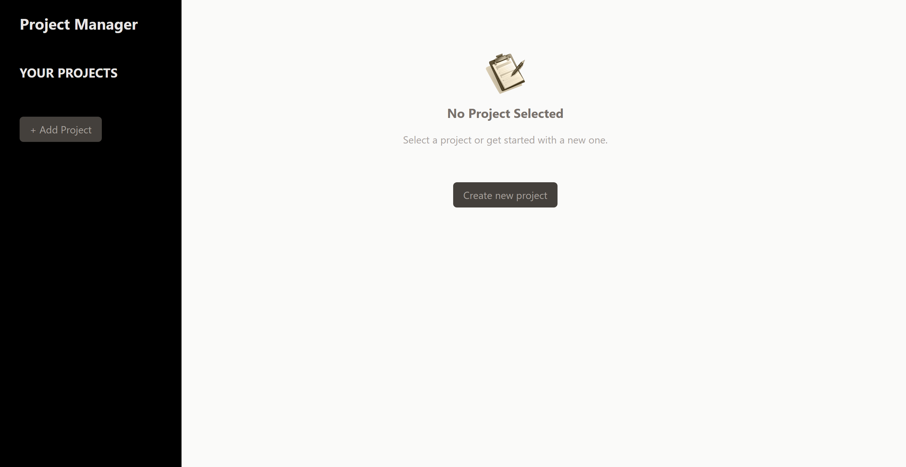
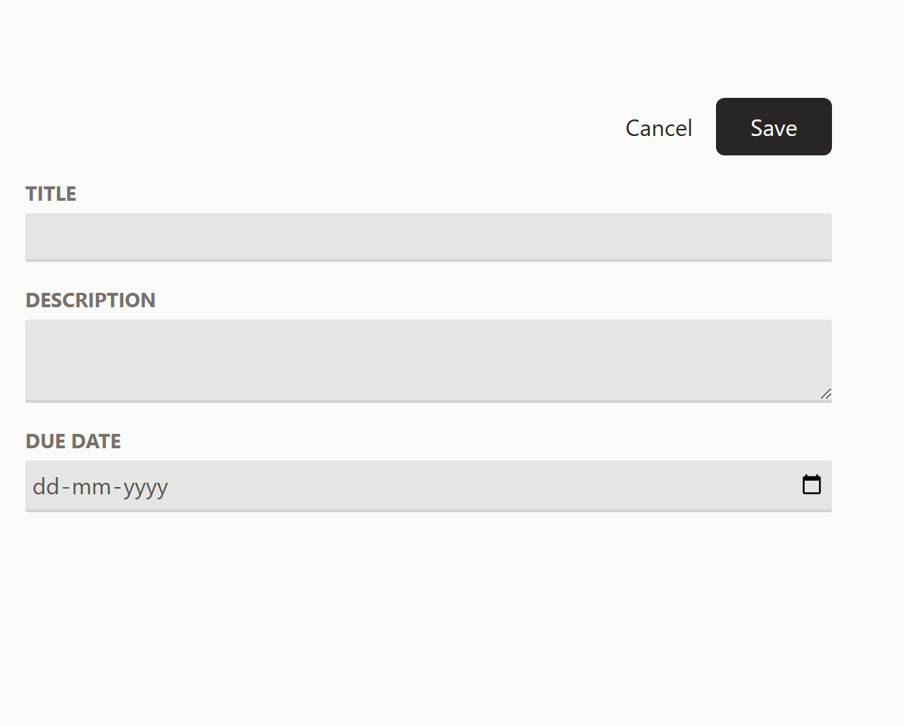
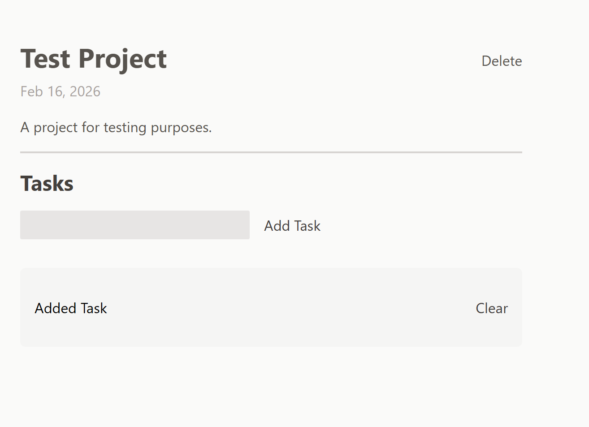

# Project Manager App

Live Demo: https://project-manager-eight-zeta.vercel.app/

## Overview
A simple project management application built using React. 
Users can create projects with a title, description, and due date, and manage tasks within each project. 
The application demonstrates component hierarchy, state management, and dynamic UI updates.

## Features
- Create projects with title, description, and due date
- Add and delete tasks within each project
- Dynamic rendering of project-specific task lists
- Clean and responsive UI using Tailwind CSS
- Component-based architecture

## Screenshots

## What I Learned
- Managing shared state across multiple components
- Understanding prop drilling and its trade-offs
- Structuring reusable and modular React components
- Handling dynamic list rendering and conditional UI updates
- Styling efficiently using Tailwind CSS utility classes

## Tech Stack
- React
- Vite
- JavaScript
- Tailwind CSS

## Installation

Clone the repository:

git clone <repo-link>

Install dependencies:

npm install

Run locally:

npm run dev

Build:

npm run build
